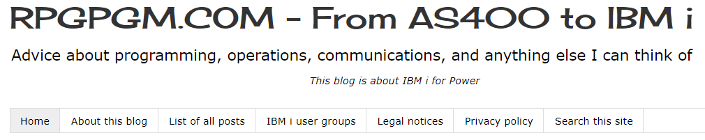
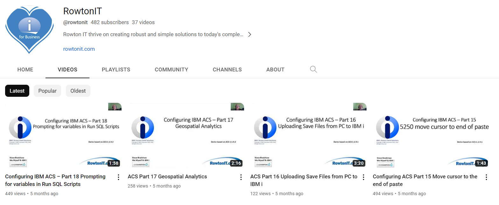
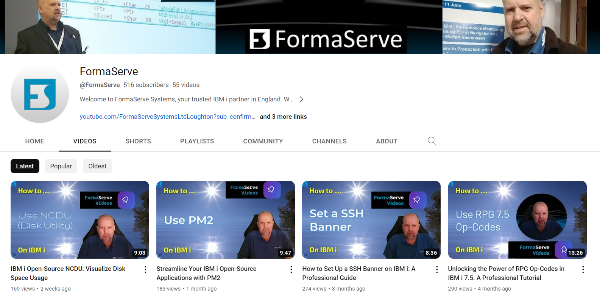

Hello😀
 

As a junior IBM i System Administrator, I have compiled a list of resources that I find helpful for learning and expanding my knowledge about the world of Power and IBM i. I am grateful to everyone on this list and to the people behind the work that they share with others. I hope this list is helpful to you as well.

"practice makes perfect😉"

----------------------------------------------------------------------------------------------------------------------------------------------------------------------------------------------------------------------------

## English
- [IBM documentation](https://www.ibm.com/docs/en/i) (ex. IBM Knowledge Center)

----------------------------------------------------------------------------------------------------------------------------------------------------------------------------------------------------------------------------

- [IBM i book](https://barrettotte.github.io/IBMi-Book) - Barrett Otte

----------------------------------------------------------------------------------------------------------------------------------------------------------------------------------------------------------------------------

- [Public IBM i 7.5 for everyone (PUB400)](https://pub400.com/) - Holger Scherer

----------------------------------------------------------------------------------------------------------------------------------------------------------------------------------------------------------------------------

- [IBM TechXchange Community](https://community.ibm.com/community/user/power/home) / [Groups](https://community.ibm.com/community/user/sitemap)

----------------------------------------------------------------------------------------------------------------------------------------------------------------------------------------------------------------------------

- [SQL for IBM i](https://www.ibm.com/support/pages/ibm-i-tutorials-demos-and-sql-examples-0) - Scott Forstie & Tim Rowe

----------------------------------------------------------------------------------------------------------------------------------------------------------------------------------------------------------------------------

- [RPGPGM](https://www.rpgpgm.com/) - Simon Hutchinson

----------------------------------------------------------------------------------------------------------------------------------------------------------------------------------------------------------------------------

- [PowerWire](https://powerwire.eu/)

  
----------------------------------------------------------------------------------------------------------------------------------------------------------------------------------------------------------------------------

- [Faq400 blog](https://blog.faq400.com/en/)

----------------------------------------------------------------------------------------------------------------------------------------------------------------------------------------------------------------------------

- [Nick Litten blog](https://www.nicklitten.com/blog/)

----------------------------------------------------------------------------------------------------------------------------------------------------------------------------------------------------------------------------

- [Seiden Group](https://www.seidengroup.com/open-source-documentation/) (Open source on IBM i) / [Blog](https://www.seidengroup.com/blog/)

----------------------------------------------------------------------------------------------------------------------------------------------------------------------------------------------------------------------------

- [Build on Power newsletter](https://builtonpower.com/newsletters/) - Torbjörn Appehl

----------------------------------------------------------------------------------------------------------------------------------------------------------------------------------------------------------------------------

- [TechChannel](https://techchannel.com/IBM-I)

----------------------------------------------------------------------------------------------------------------------------------------------------------------------------------------------------------------------------
 
- [Common US](https://www.common.org/home)

----------------------------------------------------------------------------------------------------------------------------------------------------------------------------------------------------------------------------
  
- [Common Europe](https://comeur.org/)

----------------------------------------------------------------------------------------------------------------------------------------------------------------------------------------------------------------------------
  
- [reddit](https://www.reddit.com/r/IBMi/)

----------------------------------------------------------------------------------------------------------------------------------------------------------------------------------------------------------------------------
  
- [ALL400s](https://all400s.com/) - John Rockwell

----------------------------------------------------------------------------------------------------------------------------------------------------------------------------------------------------------------------------
  
- [IBM i reference pages](https://ibmireference.blogspot.com/) - Michael D. Mayer

----------------------------------------------------------------------------------------------------------------------------------------------------------------------------------------------------------------------------

### Videos
- [Power Systems VUG](https://www.youtube.com/@PowerSystemsVUG)

----------------------------------------------------------------------------------------------------------------------------------------------------------------------------------------------------------------------------

- [AS400 and SQL Tricks](https://www.youtube.com/@AS400andSQLTricks)

----------------------------------------------------------------------------------------------------------------------------------------------------------------------------------------------------------------------------

- [RowtonIT](https://www.youtube.com/@rowtonit) - Steve Bradshaw

----------------------------------------------------------------------------------------------------------------------------------------------------------------------------------------------------------------------------

- [FormaServe](https://www.youtube.com/@FormaServe) - Andy Youens

----------------------------------------------------------------------------------------------------------------------------------------------------------------------------------------------------------------------------

### Podcasts
- [The incredible i show](https://www.common.org/education-events/i-show-podcast)

----------------------------------------------------------------------------------------------------------------------------------------------------------------------------------------------------------------------------

- [IBM Bi-Weekly](https://open.spotify.com/show/0dmMCvJ2xZlaYJlONk0pC4)

----------------------------------------------------------------------------------------------------------------------------------------------------------------------------------------------------------------------------

## Français
- [Documentation d'IBM](https://www.ibm.com/docs/fr/i)

----------------------------------------------------------------------------------------------------------------------------------------------------------------------------------------------------------------------------

- [Power Systems et IBM i](https://poweribmi.fr/)

----------------------------------------------------------------------------------------------------------------------------------------------------------------------------------------------------------------------------

- [Volubis](https://www.volubis.fr/af400b.html) / [Forum](https://www.volubis.fr/forum/)

----------------------------------------------------------------------------------------------------------------------------------------------------------------------------------------------------------------------------

- [Gaia Mini Systèmes blog](https://www.gaia.fr/blog/) -  Pierre-Louis Berthoin & Nathanael Bonnet

----------------------------------------------------------------------------------------------------------------------------------------------------------------------------------------------------------------------------

- [Livres expertise IBM i](https://i.gayte.it/en/livres/) - Dominique Gayte

----------------------------------------------------------------------------------------------------------------------------------------------------------------------------------------------------------------------------

- [Common France](https://commonfrance.fr/CommonFR/wp/)

----------------------------------------------------------------------------------------------------------------------------------------------------------------------------------------------------------------------------

### Videos
- [Volubis Vimeo](https://vimeo.com/cmasse)

----------------------------------------------------------------------------------------------------------------------------------------------------------------------------------------------------------------------------

- [Volubis YouTube](https://www.youtube.com/@societeVolubis)

