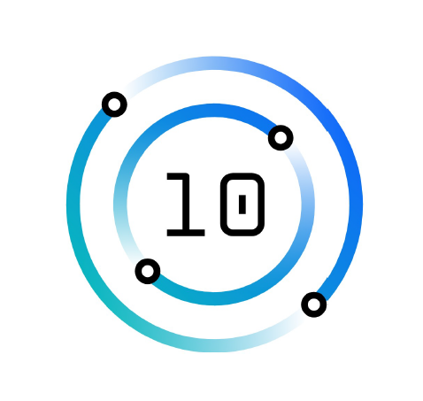
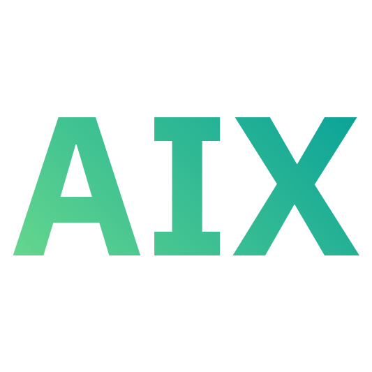
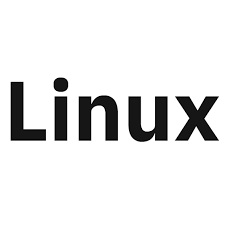

Hello😀
 

As a junior IBM i System Administrator, I have compiled a list of resources that I find helpful for learning and expanding my knowledge about the world of Power and IBM i. I am grateful to everyone on this list and to the people behind the work that they share with others. I hope this list is helpful to you as well.

## English
- [IBM documentation](https://www.ibm.com/docs/en/i) (ex. IBM Knowledge Center)
- [IBM i book](https://barrettotte.github.io/IBMi-Book) - Barrett Otte
- [PUB400](https://pub400.com/) - Holger Scherer
- [IBM TechXchange Community](https://community.ibm.com/community/user/power/home) / [Groups](https://community.ibm.com/community/user/sitemap)
- [SQL for IBM i](https://www.ibm.com/support/pages/ibm-i-tutorials-demos-and-sql-examples-0) - Scott Forstie & Tim Rowe
- [RPGPGM](https://www.rpgpgm.com/) - Simon Hutchinson
- [Nick Litten's blog](https://www.nicklitten.com/blog/)
- [PowerWire](https://powerwire.eu/)
- [Seiden Group](https://www.seidengroup.com/open-source-documentation/) (Open source on IBM i) / [Blog](https://www.seidengroup.com/blog/)
- [Build on Power's newsletter](https://builtonpower.com/newsletters/) - Torbjörn Appehl
- [TechChannel](https://techchannel.com/IBM-I)
- [reddit](https://www.reddit.com/r/IBMi/)
- [Common US](https://www.common.org/home)
- [Common Europe](https://comeur.org/)
- [ALL400s](https://all400s.com/) - John Rockwell
- [IBM i reference pages](https://ibmireference.blogspot.com/) - Michael D. Mayer

### Videos
- [AS400 and SQL Tricks](https://www.youtube.com/@AS400andSQLTricks)
- [RowtonIT](https://www.youtube.com/@rowtonit) - Steve Bradshaw
- [FormaServe](https://www.youtube.com/@FormaServe) - Andy Youens

### Podcasts
- [Incredible i Show Podcast](https://www.common.org/education-events/i-show-podcast)
- [IBM Bi-Weekly](https://open.spotify.com/show/0dmMCvJ2xZlaYJlONk0pC4)
--------------------------------------------------------------------------------------------------------------------------------------------------------------------

## Français
- [Documentation d'IBM](https://www.ibm.com/docs/fr/i)
- [Power Systems et IBM i](https://poweribmi.fr/)
- [Volubis](https://www.volubis.fr/af400b.html) / [Forum](https://www.volubis.fr/forum/)
- [Gaia Mini Systèmes Blog](https://www.gaia.fr/blog/) -  Pierre-Louis Berthoin & Nathanael Bonnet
- [Livres expertise IBM i](https://i.gayte.it/en/livres/) - Dominique Gayte
- [Common France](https://commonfrance.fr/CommonFR/wp/)

### Videos
- [Volubis Vimeo](https://vimeo.com/cmasse)
- [Volubis YouTube](https://www.youtube.com/@societeVolubis)
